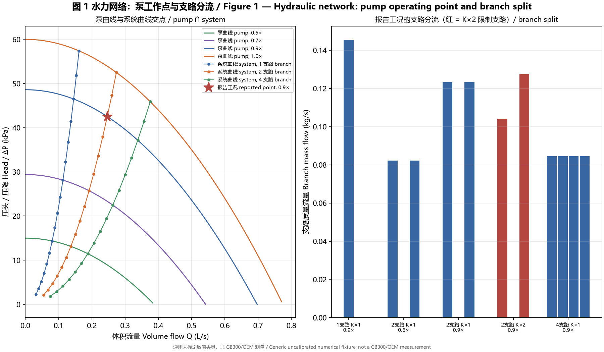
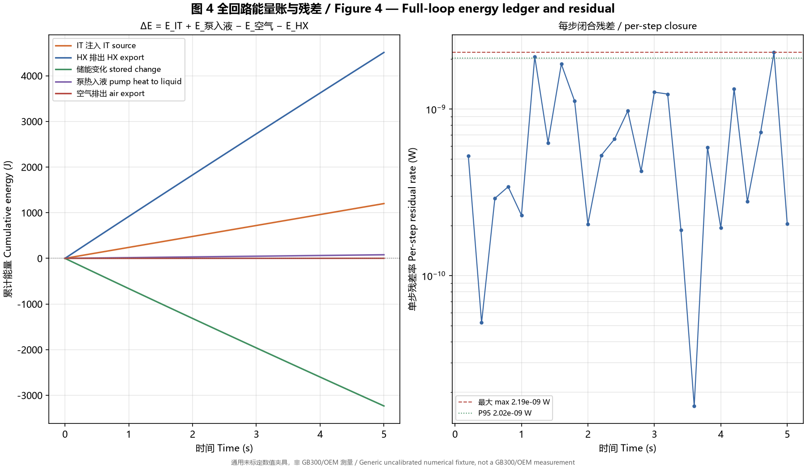

# C2C-DTB / 算力到冷却数字测试台

Compute-to-Cooling Digital Test Bench is a physics-based rack liquid-cooling digital twin and control-research platform. It connects IT power, device thermal storage, flow-dependent coldplates, solved branch hydraulics, finite coolant transport, CDU/HX/FWS heat rejection, measured-state feedback, PLC logic and actuator dynamics.

V0.1 is a local engineering model, not CFD, SCADA, a production PLC, or an OEM/NVIDIA performance claim. All GB300-class and CDU values are labeled assumptions until replaced by measured, OEM, literature, or calibrated data.

V0.1 是本地工程模型，不是 CFD、SCADA、生产 PLC，也不构成 OEM/NVIDIA 性能声明。所有 GB300 级与 CDU 参数在被实测、OEM、文献或标定数据替换前，均明确标记为假设值。

## V0.2 phase baselines / V0.2 阶段基线

V0.2 is built as an isolated tree (`v0_2/`) with its own distribution and test paths. It neither imports from nor modifies the V0.1 `src/c2c` package. Phases 1–4 have annotated tags; later phase outcomes are recorded in their reports and evidence, without implying that every diagnostic gate is a tagged final baseline.

V0.2 以隔离目录 `v0_2/` 构建，拥有独立的发行包与测试路径，既不导入、也不修改 V0.1 的 `src/c2c` 包。阶段 1–4 有 annotated tag；后续阶段的结论记录在报告与证据中，不把每个诊断门禁误称为最终基线标签。

| Phase | Publication | Commit or status | Deliverable | Report | Gate |
|---|---|---|---|---|---|
| 1 + 2 | `v0.2-phase1-2` | `020f681` | Refactor plan, V0.1 manifest, architecture, 16 contracts | [PHASE2_REVIEW_SUMMARY.md](PHASE2_REVIEW_SUMMARY.md) | `PHASE2_GATE_STATUS = PASS` |
| 3 | `v0.2-phase3` | `9aa8cc0` | Isolated constant-C thermal core and integrator | [PHASE3_THERMAL_REPORT.md](PHASE3_THERMAL_REPORT.md) | `PHASE3_GATE_STATUS = PASS` |
| 4 | `v0.2-phase4` | `5588915` | Physical coolant loop, pump network, finite CDU/FWS | [PHASE4_PHYSICAL_PLANT_REPORT.md](PHASE4_PHYSICAL_PLANT_REPORT.md) | `PASS` (generic fixture) |
| 4.1 | this repository | completed | Coupled pump→flow→Rth→temperature authority | [PHASE4_1_CONTROL_AUTHORITY_REPORT.md](PHASE4_1_CONTROL_AUTHORITY_REPORT.md) | `PASS` (generic fixture) |
| 5 original | this repository | historical, superseded | First feedback baseline | [Phase 5 report](PHASE5_FEEDBACK_CONTROL_REPORT.md) | Implementation `PASS`; superseded after ownership audit |
| 5R1 | this repository | historical baseline | PLC-only command ownership and lineage | [Phase 5R1 report](PHASE5_R1_ACTUATION_OWNERSHIP_REPORT.md) | `APPROVED`; ownership remains authoritative |
| 5.1 original | this repository | historical, blocked | Original-baseline ownership audit | [Phase 5.1 report](PHASE5_1_FEEDBACK_QUALIFICATION_REPORT.md) | `BLOCKED`; found superseded-baseline defect |
| 5.1R | this repository | blocked | Frozen R1 nominal regulation qualification | [Phase 5.1R report](PHASE5_1R_FEEDBACK_QUALIFICATION_REPORT.md) | `NO_FEASIBLE_REGULATION_REGION` |
| 5R2 | this repository | completed | Authority-derived generic target and coarse candidate reselection | [Phase 5R2 report](PHASE5_R2_CONTROL_TARGET_REVISION_REPORT.md) | Target revision completed |
| 5R2.1 | this repository | completed | Three-mesh outer-selection robustness | [Phase 5R2.1 report](PHASE5_R2_1_SELECTION_ROBUSTNESS_REPORT.md) | Robust selection: `outer_a` |
| 5R2.2 | this repository | historical R2 baseline frozen | `inner_b + outer_a` R2 baseline | [Phase 5R2.2 report](PHASE5_R2_2_FINAL_BASELINE_REPORT.md) | `PASS` for R2; not the final R5 baseline |
| 5.1R2 | this repository | blocked | Frozen R2 nominal regulation qualification | [Phase 5.1R2 report](PHASE5_1R2_FEEDBACK_QUALIFICATION_REPORT.md) | `BLOCKED_FINAL_FROZEN_FEEDBACK_NOMINAL_REGULATION_NOT_QUALIFIED` |
| 5R3 | this repository | diagnostic complete | Bidirectional controller revision | [Phase 5R3 report](PHASE5_R3_BIDIRECTIONAL_CONTROLLER_REVISION_REPORT.md) | `NO_EXISTING_OUTER_CANDIDATE_HAS_BIDIRECTIONAL_REGULATION` |
| 5R4–R4.2 | this repository | diagnostic complete | Symmetric PI tuning and feasibility boundary | [R4](PHASE5_R4_BIDIRECTIONAL_PID_RETUNING_REPORT.md), [R4.1](PHASE5_R4_1_LOCAL_PI_REFINEMENT_REPORT.md), [R4.2](PHASE5_R4_2_PI_FEASIBILITY_BOUNDARY_REPORT.md) | No symmetric PI overlap in registered domain |
| 5R5 | this repository | candidate, not final baseline | Directional PI candidate | [Phase 5R5 report](PHASE5_R5_DIRECTIONAL_PI_REPORT.md) | `DIRECTIONAL_PI_CANDIDATE_FOUND_WITH_STARTUP_SAFETY_BLOCKER` |
| 5R5.1 | this repository | diagnostic complete | Cold-start Safety handoff audit | [Phase 5R5.1 report](PHASE5_R5_1_COLD_START_SAFETY_HANDOFF_AUDIT_REPORT.md) | `NORMAL_HANDOFF_MISCLASSIFIED_AS_DEGRADED` |
| 5R5.2 | this repository | diagnostic complete | Silent tracking-fault separation | [Phase 5R5.2 report](PHASE5_R5_2_SILENT_TRACKING_FAULT_QUALIFICATION_REPORT.md) | `MEASURED_ONLY_SILENT_TRACKING_FAULT_SEPARATION_PASS` |
| 5R5.2.1R4.3D | `v0.2-p15-history-fixture` | P15-only historical fixture baseline | Deterministically reconstructed and frozen P15/C9R input; unchanged R4.3B candidate passes 10/10 | [P15 freeze report](PHASE5_R5_2_1R4_3D_P15_FREEZE_REPORT.md), [manifest](phase5_r5_2_1_p15_reconstructed_history_freeze.json) | `P15_RECONSTRUCTED_HISTORICAL_FIXTURE_FROZEN_AND_VALIDATED`; full P history unavailable |

Phase 1 and Phase 2 share a single commit; no separate Phase 1 commit exists. Phase 5R5.2 is diagnostic evidence only: production Safety remains unchanged, the R5 controller remains a candidate, and independent qualification has not happened. Phase 6 feedforward and Phases 7–9 have not started.

The later R4.3D freeze is **a historical-fixture baseline for P15 only**, not a production-control baseline. P15 is the R4-registered C9R alias, reconstructed from a deterministic historical generator; it is not an exact recovered original capture. Its frozen 31-record input passed the unchanged R4.3B tracker in ten identical runs with prefix causality. The other 19 P fixtures remain unavailable from current evidence, so `FULL_P_HISTORY_VALIDATION_AVAILABLE = NO`, complete historical validation cannot be claimed, and production port remains blocked. The [freeze record](PHASE5_R5_2_1_P15_RECONSTRUCTED_HISTORICAL_FIXTURE_FREEZE.md) distinguishes exact requirements from incidental anchor timing. No Phase 6 feedforward is authorized.

The previously uncommitted [R5.3R production-port trial](PHASE5_R5_3R_PRODUCTION_SAFETY_TRACKING_PORT_REPORT.md) and [R5.3R-A false-positive audit](PHASE5_R5_3R_A_TUNE01_FALSE_POSITIVE_ROOT_CAUSE_AUDIT.md) are published as **historical blocked/audit evidence**, not as an active production port. The trial's Safety/plant edits were reverted; the audit identified a continuous-command reference-frame false positive that motivated the later R4 revisions. Neither report authorizes production deployment.

The full control-test collection still contains the intentionally preserved R4.1 `R41-7` historical failure (`test_r41_7_reversal_during_outage_is_causal` in the old deferred-demand engine). The current R4.3B candidate's corresponding check and frozen P15 gate pass. Do not interpret the old failure as a new R4.3B failure or claim that the entire historical test collection is green.

后续 R4.3D 仅冻结 **P15 历史测试输入基线**，不是生产控制基线。P15 是登记在案的 C9R 对应案例，通过历史确定性生成逻辑重建，并非找回原始采集文件。31 条冻结输入在未修改的 R4.3B 上重复运行 10 次均通过，前缀因果性也通过。其余 19 个 P 案例的输入目前仍不可恢复，因此不能宣称完整历史验证通过，也不能进入生产移植；Phase 6 前馈尚未启动。

阶段 1 与阶段 2 共用一个 commit，不存在单独的 Phase 1 commit。Phase 5R5.2 只是诊断证据：生产 Safety 未修改，R5 控制器仍是候选方案，尚未独立验证。Phase 6 前馈与 Phase 7–9 尚未开始。

A phase gate covers only the evidence in its own report. No PASS above means GB300/OEM calibration, equipment safety, or an authorized controller. Every V0.2 fixture parameter stays `ENGINEERING_ASSUMPTION / NUMERICAL_TEST_FIXTURE / UNVALIDATED` until replaced by measured or vendor data. The published evidence reproduces directly from the repository root:

每个阶段门禁只覆盖其报告中的证据范围。以上任何 PASS 都不代表 GB300/OEM 标定、设备安全或可授权的控制器。在替换为实测或厂家数据前，V0.2 的全部夹具参数保持 `ENGINEERING_ASSUMPTION / NUMERICAL_TEST_FIXTURE / UNVALIDATED`。已发布的证据可从仓库根目录直接复现：

```powershell
.venv\Scripts\python -m pytest -c v0_2/pyproject.toml v0_2/tests -W error
.venv\Scripts\python -m v0_2.examples.phase3_validation
.venv\Scripts\python -m v0_2.examples.phase4_validation
.venv\Scripts\python -m v0_2.examples.phase4_1_validation
.venv\Scripts\python -m v0_2.examples.phase5_validation
.venv\Scripts\python -m v0_2.examples.phase5_evidence
.venv\Scripts\python -m v0_2.examples.phase5_r1_ownership_audit
.venv\Scripts\python -m v0_2.examples.phase5_r1_evidence
.venv\Scripts\python -m v0_2.examples.phase5_r2_evidence
.venv\Scripts\python -m v0_2.examples.phase5_r2_figures
.venv\Scripts\python -m v0_2.examples.phase5_r2_1_robustness
.venv\Scripts\python -m v0_2.examples.phase5_r2_2_finalization
.venv\Scripts\python -m v0_2.examples.phase5_r3_bidirectional_selection
.venv\Scripts\python -m v0_2.examples.phase5_r4_outer_tuning
.venv\Scripts\python -m v0_2.examples.phase5_r4_1_local_pi_refinement
.venv\Scripts\python -m v0_2.examples.phase5_r4_2_pi_boundary_search
.venv\Scripts\python -m v0_2.examples.phase5_r5_directional_pi
.venv\Scripts\python -m v0_2.examples.phase5_r5_1_safety_handoff_audit
.venv\Scripts\python -m v0_2.examples.phase5_r5_2_silent_tracking_fault
.venv\Scripts\python -m v0_2.examples.phase5_r5_2_1r4_3d_freeze
.venv\Scripts\python -m pip install -e "./v0_2[figures]"
.venv\Scripts\python -m v0_2.examples.phase4_figures
.venv\Scripts\python -m v0_2.examples.phase4_report
.venv\Scripts\python -m v0_2.tools.generate_docs_figures
```

The plotting extra is opt-in; the thermal core itself still runs on numpy alone.

绘图依赖为可选安装项；热学核心本身仍只依赖 numpy。

## System architecture / 系统架构


Phase 3's fixed `R_test_bath` exists only in its isolated thermal-validation fixture. The Phase 4/4.1/5 physical path uses advective coolant volumes, a solved pump/network operating point, finite CDU inventory, HX and FWS boundary. Phase 5 uses feedback only; any Phase 6 feedforward path is planned, not implemented.

Phase 3 的固定 `R_test_bath` 仅用于独立热学验证夹具。Phase 4/4.1/5 的物理路径使用有限体积冷却液输运、泵与网络交点、有限 CDU 储液、HX 与 FWS 边界。Phase 5 仅实现反馈控制；Phase 6 前馈仍为规划项。

## Validation summary / 验证摘要

| Layer | Verified in the generic fixture | Evidence | Status |
|---|---|---|---|
| Thermal core | RC storage, flow-dependent coldplate, conservative integration | [Phase 3 report](PHASE3_THERMAL_REPORT.md) | PASS |
| Physical coolant loop | Hydraulics, finite transport, CDU/HX/FWS, mass/energy | [Phase 4 report](PHASE4_PHYSICAL_PLANT_REPORT.md) | PASS |
| Control authority | Actual speed changes flow, Rth, heat transfer and temperature | [Phase 4.1 report](PHASE4_1_CONTROL_AUTHORITY_REPORT.md) | PASS |
| Original feedback baseline | Historical measured-state Phase 5 implementation | [Phase 5 report](PHASE5_FEEDBACK_CONTROL_REPORT.md) | PASS historically; superseded |
| Ownership correction | Safety constraints → PLC command → actuator, with lineage | [Phase 5R1 report](PHASE5_R1_ACTUATION_OWNERSHIP_REPORT.md) | APPROVED / FROZEN |
| Feedback qualification restart | Plant-only bracket scan for frozen 305 K target | [Phase 5.1R report](PHASE5_1R_FEEDBACK_QUALIFICATION_REPORT.md) | BLOCKED: `NO_FEASIBLE_REGULATION_REGION` |
| Control-target revision | 120 W/device frozen-authority midpoint and original-grid reselection | [Phase 5R2 report](PHASE5_R2_CONTROL_TARGET_REVISION_REPORT.md) | STOP FOR USER REVIEW: outer changed to `outer_b` |

These statuses validate software behavior and numerical fixtures, not physical hardware.

## Selected results / 精选结果


`HOLDOUT-01-combined` is a **capacity-limited combined stress holdout**. It is retained as
historical Phase 5 evidence and is not nominal-settling or Phase 5.1 qualification evidence.

Phase 5.1R did not generate a nominal regulation figure: even at the lowest registered
120 W/device load and maximum frozen pump speed, the plant-only final-window mean was 312.697 K,
so the frozen 305 K target was not bracketed. The stress image below remains stress evidence only.

Phase 5R2 derived `313.71072595542387 K` from the exact midpoint of the frozen plant's 120 W/device
authority window. This is a generic numerical research setpoint, not a hardware limit. At that stage,
reselection changed the outer candidate from `outer_c` to `outer_b` and paused finalization for review.

Phase 5R2.1 found `outer_b` to be the raw IAE winner at all three registered meshes, but the
candidate differences are smaller than the pre-registered numerical-sensitivity bound. Applying the
next frozen criterion, control total variation, selected `outer_a`. R2.1 paused finalization for review;
it did not validate nominal settling.

After explicit user authorization, Phase 5R2.2 completed historical stress characterization,
three-mesh selected-baseline convergence, ownership regression and ten-run stability, then froze the
historical generic R2 baseline as `inner_b + outer_a`. Phase 5.1R2 subsequently ran and was blocked;
the R2 freeze is not nominal-settling or hardware validation. Phase 6 has not started.

Every image is generated by repository Python code and captioned as a generic numerical fixture. See the [results gallery](docs/results/README.md) and [figure manifest](docs/results/FIGURE_MANIFEST.md) for commands, source data and limitations.

## Phase 4 evidence at a glance / Phase 4 证据速览



Branch flows come from solving the pump curve against the actual series-plus-parallel system curve at shared supply/return pressure junctions. There is no after-the-fact normalization to force the split. The star is the reported 2-branch 0.9× operating point.

支路流量来自泵曲线与实际“串联加并联”系统曲线在共用供回液压力节点上的求交，不做任何事后归一化去凑分流比例。星号为 2 支路 0.9× 的报告工作点。



The full-loop ledger closes to a maximum signed residual of `4.18e-9 J` across the twelve qualified runs. Pump electrical consumption is reported separately rather than added in full a second time, and hydraulic work becomes heat only at passive resistance receivers.

全回路账本在十二组合格运行中最大有符号残差为 `4.18e-9 J`。泵电能单独报告，不整体二次计入；水力功只在被动阻力处转为热。

All seven bilingual figures, with their per-section captions, are embedded in [PHASE4_PHYSICAL_PLANT_REPORT.md](PHASE4_PHYSICAL_PLANT_REPORT.md).

七张中英双语图及逐节说明均嵌入 [PHASE4_PHYSICAL_PLANT_REPORT.md](PHASE4_PHYSICAL_PLANT_REPORT.md)。

The same figures, their captions and the underlying result tables are also rendered as one self-contained page: **[PHASE4_EVIDENCE.html](PHASE4_EVIDENCE.html)**. It is a single file with no sibling assets, so download it and open it in a browser. GitHub shows an `.html` file's source rather than rendering it, and this repository does not publish GitHub Pages, so the page is not displayed inline here. Rebuild it with `python -m v0_2.examples.phase4_report`.

同样的图、图注与结果表另有一个自包含页面：**[PHASE4_EVIDENCE.html](PHASE4_EVIDENCE.html)**。该页为单文件、无外部依赖，下载后用浏览器打开即可。GitHub 对 `.html` 文件显示源码而非渲染结果，本仓库也未启用 GitHub Pages，因此该页不会在此内联展示。可用 `python -m v0_2.examples.phase4_report` 重新生成。

## Legacy V0.1 benchmark

This command runs the older simplified V0.1 feedback/feedforward model. It does not execute the
V0.2 architecture and is not Phase 6 feedforward evidence; V0.2 Phase 6 has not started.

以下命令运行旧版简化的 V0.1 反馈/前馈模型，不执行 V0.2 架构，也不能作为 Phase 6 前馈证据；
V0.2 Phase 6 尚未开始。

```powershell
py -3.11 -m venv .venv
.venv\Scripts\python -m pip install -e ".[dev]"
.venv\Scripts\python -m c2c.simulation.runner configs/scenarios/workload_step.yaml
.venv\Scripts\python -m c2c.simulation.runner configs/scenarios/workload_step.yaml --locale zh-CN
.venv\Scripts\python -m pytest
```

Linux/macOS:

```bash
python3 -m venv .venv
.venv/bin/python -m pip install -e '.[dev]'
.venv/bin/c2c-dtb --locale zh-CN
.venv/bin/python -m pytest
```

The benchmark writes `config.yaml`, `metadata.json`, `timeseries.csv`, `summary.json`, plots, and a self-contained `report.html` under `results/<run-id>/`. Machine-readable field names remain stable in English; `--locale en` and `--locale zh-CN` localize human-facing report copy, case names, threshold labels, and plots.

基准测试会在 `results/<run-id>/` 下生成配置、元数据、时序 CSV、摘要 JSON、图表和自包含 HTML 报告。机器可读字段名保持英文稳定；`--locale en` 与 `--locale zh-CN` 用于切换报告文字、工况名称、阈值标签和图表语言。

## Threshold interpretation / 阈值解释

`summary.json` and `report.html` now separate commanded safety limits from process response. A coolant temperature temporarily above its setpoint is a control deviation, not automatically a guardrail violation. The `threshold_checks` array reports the measured value, comparator, configured limit, unit, and pass/fail result for each case.

`summary.json` 与 `report.html` 会区分“控制指令安全限值”和“被控过程响应”。冷却液温度短时高于设定值属于控制偏差，并不自动等于安全限值被突破。每个工况的 `threshold_checks` 都会列出实测值、比较符、配置阈值、单位及通过/超限状态。

Both cases use identical feedback control before the first load step. Feedforward is enabled at that step; `controller_response_delay_s` measures valve movement by 2 percentage points in both cases, while `setpoint_response_delay_s` separately measures a 0.25 K setpoint change. These delays measure control outputs, not physical cooling completion. Startup and post-step supply deviations are reported separately. Missing/non-finite samples produce `INVALID`, suppressing comparisons; a zero baseline pump energy gives a null percentage change.

The report also embeds `response_timeline.png`: matched feedback/feedforward panels show GPU power, accepted/ramped temperature targets, pressure targets, pump/valve commands and the temperature/pressure inputs actually read by the PLC. `response_events.json` records first threshold crossings relative to the first load step over its high-load window, using the preceding 60 s mean as baseline. No crossing is null, not zero. The chart zooms to -30..180 s. These are simulated signal departures, not sensor detection delays: feedforward itself changes the fluid signals; static hydraulic resistance does not depend on heat. No future-load prediction or junction-temperature-driven control is claimed.

报告新增“控制响应时间线”和事件表：左右对照仅反馈与功率前馈，展示 GPU 功率、温度/压差目标、泵阀动作及 PLC 动作前读取的温度/压差。PNG 可单独导出，JSON 保留事件时间、变化阈值和基线窗口。未达到阈值显示“高负载窗口内未达到”。当前默认场景前馈泵速达到 2 个百分点变化的延迟为 0 秒，阀位为 5 秒；仅反馈阀位为 104 秒。这些是仿真阈值事件，不是硬件传感器感知延迟。

两组在首次负载阶跃前采用完全相同的反馈控制，阶跃时才启用前馈。`controller_response_delay_s` 统一表示阀位变化 2 个百分点所需时间；`setpoint_response_delay_s` 单独记录设定值变化 0.25K 的延迟。这些指标衡量控制输出，不能解释为物理降温完成时间。启动阶段与阶跃后的供液偏差分别报告；数据缺失或非有限数值标为 `INVALID` 并停止工况比较，基准泵能耗为零时百分比变化记为 null。

The default temperature setpoint now slews at 0.1 K/s (`controls.temp_setpoint_ramp_k_s`, also the default for older configs). Both cases pass the configured checks. The 3 K criterion evaluates tracking of the actual ramped control setpoint: feedforward post-step error is about 1.838 K; whole-run maximum is 2.909 K from startup. Deviation from the final accepted target is separately reported and still reaches about 3.261 K. PASS therefore does not mean the final target is reached immediately. Relative to an abrupt setpoint, hotspot peak increases about 0.077°C and illustrative facility cooling energy about 0.15%; pump energy is unchanged.

默认温度设定值以 0.1K/s 渐变（`controls.temp_setpoint_ramp_k_s`，旧配置缺省值也为此值），两工况通过配置检查。3K 阈值检验相对实际渐变控制设定值的跟踪偏差：前馈阶跃后约 1.838K，全程最大值来自启动阶段，为 2.909K。相对最终接受目标的偏差单独报告，仍可达约 3.261K；PASS 不表示已经立即达到最终目标。相对设定值突变，热点峰值增加约 0.077°C，示意性设施冷却能耗增加约 0.15%，泵能耗不变。

The legacy `gpu_temperature_c` field represents an aggregate equivalent hotspot, with CPU/other liquid heat traversing the same RC path. It is not a calibrated GPU junction temperature. See [model boundaries and review corrections](docs/review-corrections.md).

保留的 `gpu_temperature_c` 机器字段代表聚合等效热点，CPU 等液冷热仍经过同一 RC 路径；它不是已标定的 GPU 结温。参见[模型边界及审查修正](docs/review-corrections.md)。

## Safety boundary

L0 physical protection remains outside this simulator. L1 is a deterministic virtual PLC with clamps, ramps, timeout behavior, and local fallback. L2 LCI produces setpoint intent and cannot bypass L1. The default case logs LCI in shadow mode; the comparison case explicitly enables guarded feedforward for research comparison.

L0 物理保护不在本仿真器范围内。L1 是具有限幅、斜率限制、超时与本地回退能力的确定性虚拟 PLC。L2 LCI 只产生设定值意图，不能绕过 L1。默认工况仅以影子模式记录 LCI；对比工况明确启用受保护前馈，仅用于研究比较。

See [the architecture decision](docs/c2c-architecture-decision.md), [physics](docs/physics.md), [assumptions](docs/assumptions.md), and [validation plan](docs/validation.md).

## GitHub readiness / GitHub 上传准备

GitHub Actions runs Ruff and Pytest on Python 3.11–3.13 for every push and pull request. The isolated V0.2 tree is a separate distribution with its own test paths, so it is gated by its own job, which additionally builds the `v0_2` wheel and reproduces the Phase 4 evidence from outside the checkout. Generated results, local environments, caches, and downloaded references are excluded by `.gitignore`. The project is released under the [Apache License 2.0](LICENSE).

GitHub Actions 会在每次推送和拉取请求中使用 Python 3.11–3.13 执行 Ruff 与 Pytest。隔离的 V0.2 目录是独立发行包，拥有自己的测试路径，因此由单独的 job 把关，该 job 还会构建 `v0_2` wheel 并在仓库外复现 Phase 4 证据。生成结果、本地虚拟环境、缓存及下载的参考资料均已通过 `.gitignore` 排除。本项目采用 [Apache License 2.0](LICENSE) 开源许可证。
