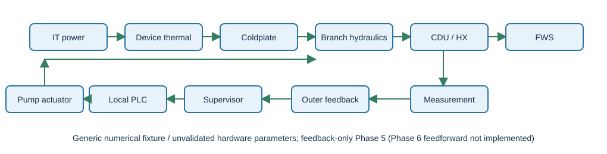
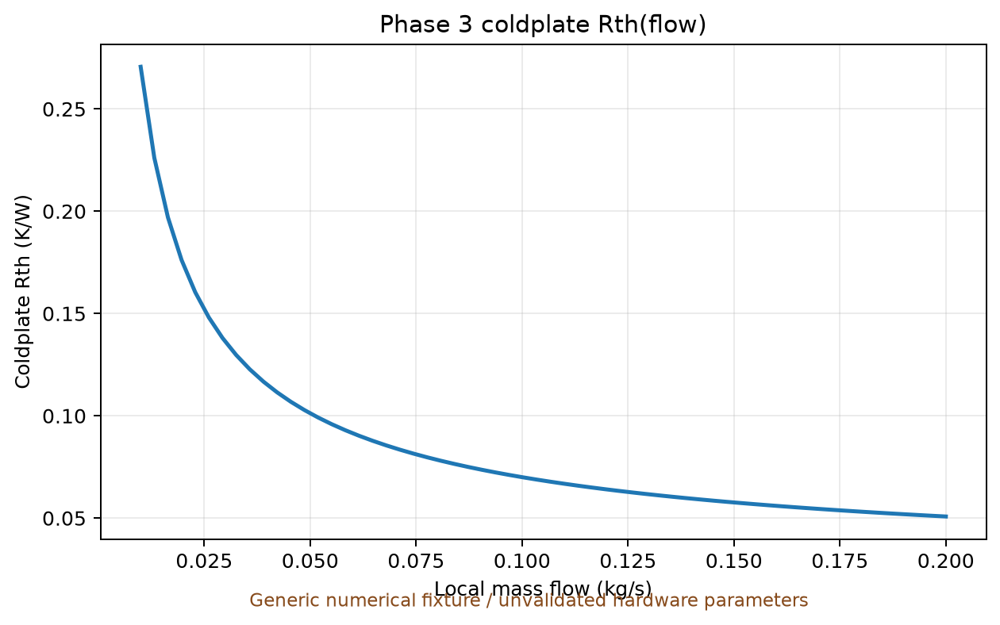
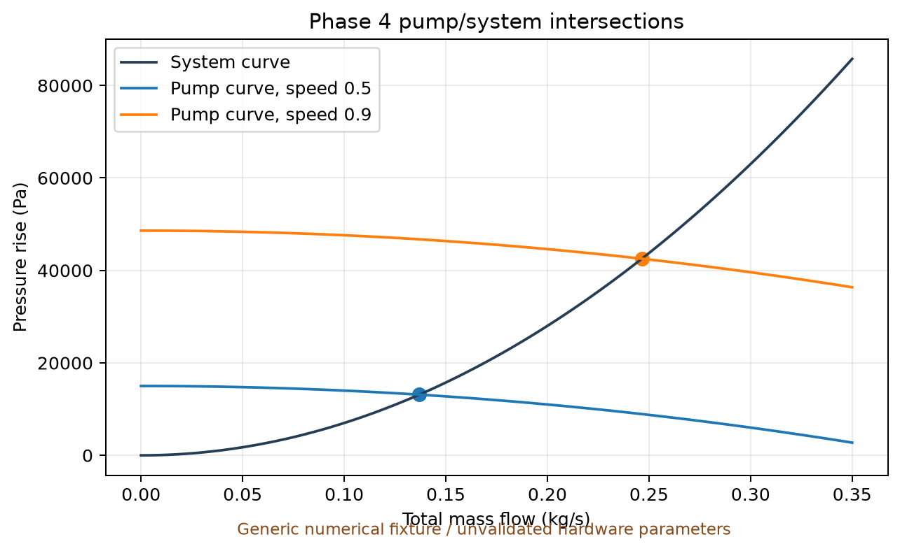
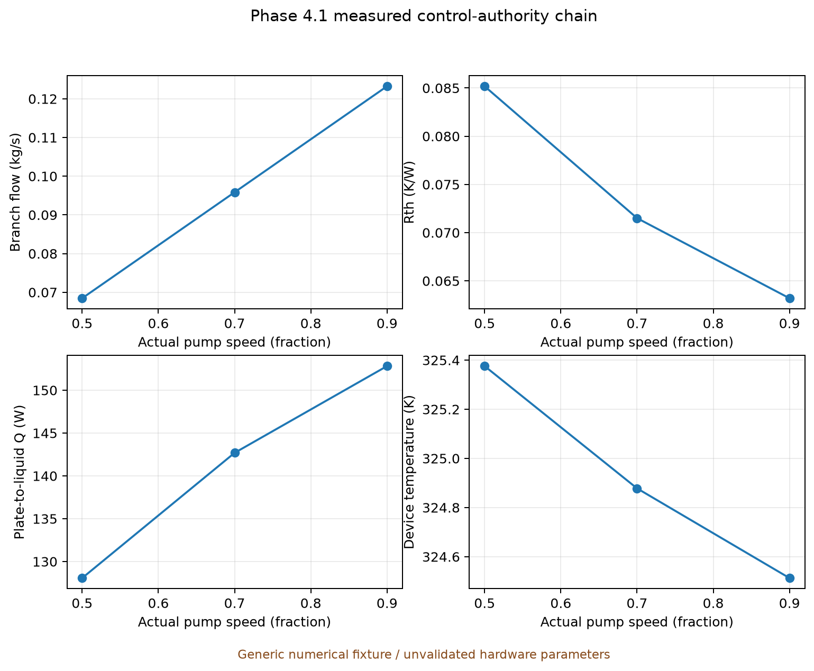
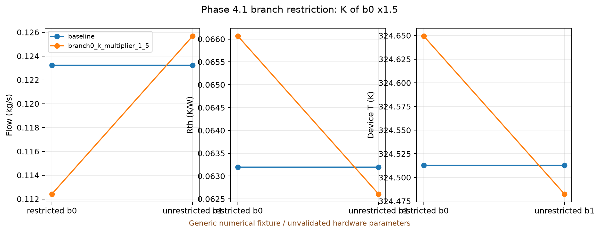
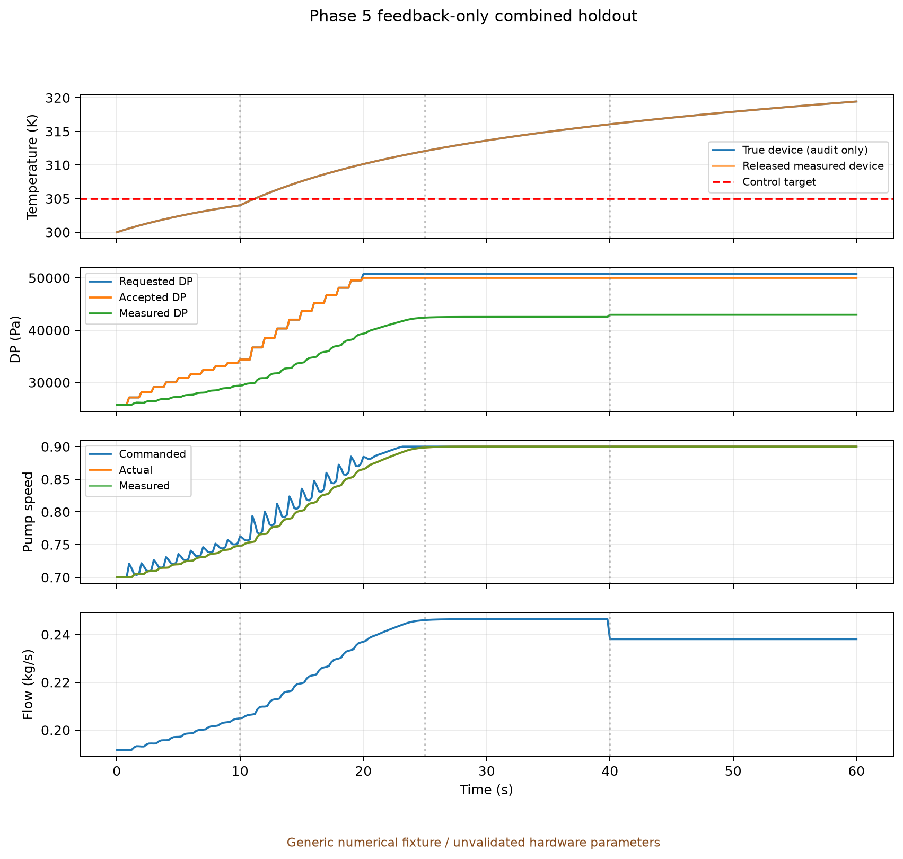
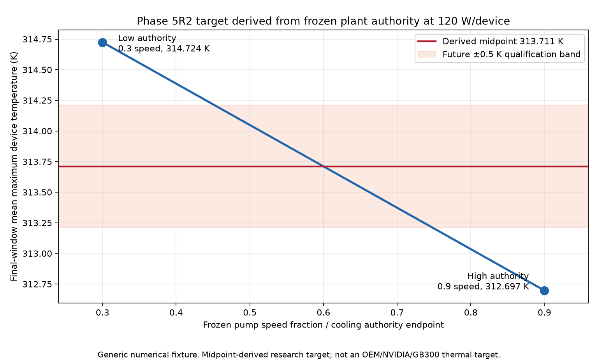
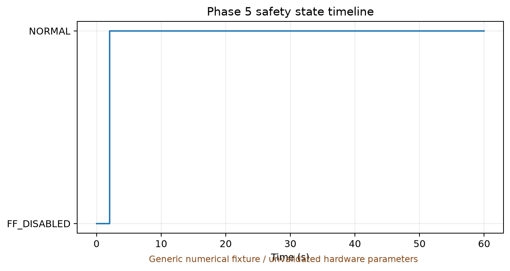

# Reproducible results gallery

All results here are **generic numerical fixtures with unvalidated hardware parameters**. They are not calibrated GB300 measurements, NVIDIA limits, OEM equipment maps, or safety certification.

## Rebuild

```powershell
.venv\Scripts\python.exe -m v0_2.examples.phase5_evidence
.venv\Scripts\python.exe -m v0_2.tools.generate_docs_figures
.venv\Scripts\python.exe -m v0_2.examples.phase5_r2_figures
```

The first command performs registered feedback tuning, the combined holdout, three-mesh qualification and ten deterministic repeated runs. The second reads those outputs and Phase 4.1 validation data to render the gallery.

## Gallery













`HOLDOUT-01-combined` is historical Phase 5 capacity-stress evidence, not nominal settling
evidence. Phase 5.1 stopped at the actuation-ownership gate; no nominal qualification figure
was produced. See `phase5_1_ownership_audit.json` and the root Phase 5.1 report.

Phase 5.1R restarted against the frozen R1 baseline. Its plant-only scan is recorded in
`phase5_1r_feasibility_scan.json`; no candidate bracketed 305 K, so the gate stopped before nominal
closed-loop execution. Consequently `phase5_nominal_regulation_r1.png` does not exist and the stress
figure above was not promoted to nominal evidence.



Generic numerical fixture. The target is derived from the midpoint of frozen plant cooling
authority at 120 W/device. It is not an OEM/NVIDIA/GB300 thermal target. Reselection changed the
outer controller from `outer_c` to `outer_b`, so this is target-feasibility evidence only; the final
R2 baseline, stress characterization, convergence, stability and nominal qualification are pending.

Phase 5R2.1 subsequently ran all 36 registered outer-candidate/mesh/training combinations. The raw
IAE winner was `outer_b` at every mesh, but the candidate differences were below the registered
numerical uncertainty bounds. Control-TV tie-breaking selected `outer_a`, so no final R2 baseline,
historical stress result, convergence result, stability result or nominal figure was generated.

Phase 5R2.2 later applied explicit user authorization for `outer_a`, ran the previously withheld
historical stress, selected-baseline convergence, ownership and ten-run stability checks, and froze
the final generic R2 baseline as `inner_b + outer_a`. This still does not provide a nominal Phase
5.1R2 regulation figure; Phase 5.1R2 has not started.



Traceability and limitations are listed in [FIGURE_MANIFEST.md](FIGURE_MANIFEST.md). The underlying Phase 5 data are in `phase5_evidence.json`; the original Phase 5.1 blocker is in `phase5_1_ownership_audit.json`; the Phase 5.1R feasibility blocker is in `phase5_1r_feasibility_scan.json`; Phase 4.1 source data are in `phase4_1_figure_source.json`.
